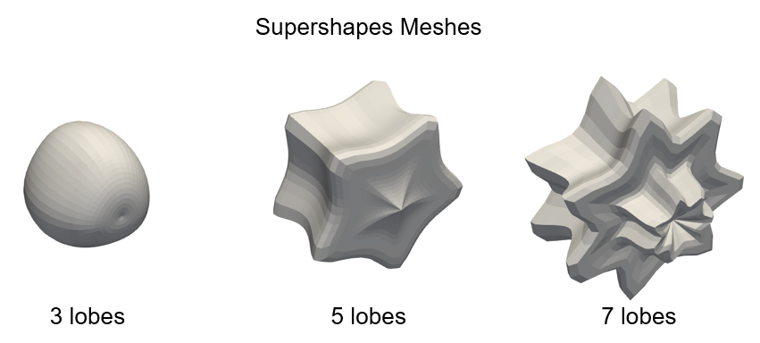
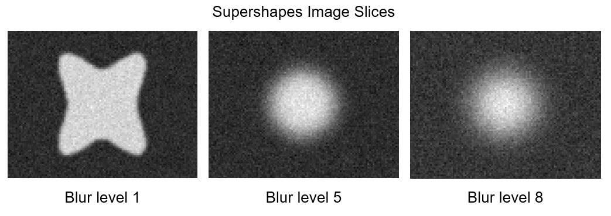
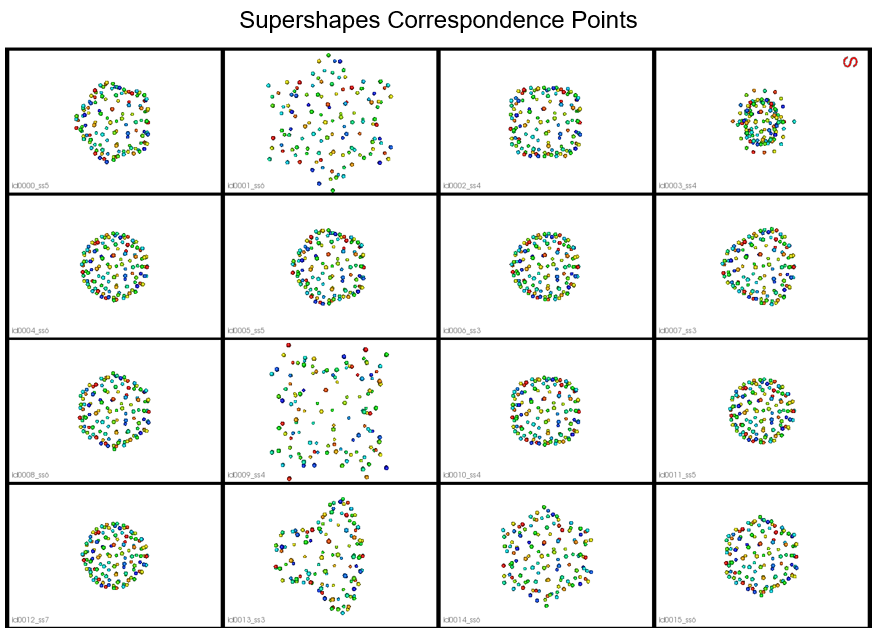

# VIB-DeepSSM
Implementation of "[From Images to Probabilistic Anatomical Shapes: A Deep Variational Bottleneck Approach](https://arxiv.org/abs/2205.06862)". 
Please cite this [paper](https://arxiv.org/abs/2205.06862) if you use this code in research.

## Supershapes Example

An example ([run_experiment.py](run_experiment.py)) of using VIB-DeepSSM is provided using a synthetic dataset called "Supershapes". This data was generated using the [Shape Cohort Generation](http://sciinstitute.github.io/ShapeWorks/6.3/notebooks/getting-started-with-shape-cohort-generation.html) package from [ShapeWorks](http://sciinstitute.github.io/ShapeWorks/6.3/index.html). 

A set of 1200 supershape meshes were generated with between 3 and 7 lobes.

  

The input images were generated from the meshes using the [Shape Cohort Generation](http://sciinstitute.github.io/ShapeWorks/6.3/notebooks/getting-started-with-shape-cohort-generation.html) package and blurred various degrees between 1 and 8. 

  

The training points were optimized using [ShapeWorks Incremental Optimization](http://sciinstitute.github.io/ShapeWorks/6.3/use-cases/multistep/incremental_supershapes.html).

  

The data is avaliable in PyTorch loader format here: [Supershapes Data Loaders](https://sci.utah.edu/~shapeworks/doc-resources/VIB-DeepSSM/loaders.zip)

From the generated data, 1000 image/point pairs were randomly selected for training, 100 for validation, and 100 for testing. The z-dimension is selected to be 5 via PCA on the training particles preserving 95% of the variability. The model was trained using the parameters in [run_experiment.py](run_experiment.py) and the best model obtained is provided, this predicted the test points with an MSE of 0.6134 +- 1.961. 

To analyze the results, we consider the correlation between the root relative mean square error and predicted uncertainty both sample-wise and point/particle-wise. We can see the predicted uncertainty is higher where the model predictions are less accurate. 

  

  

We can also consider the correlation between the predicted uncertainty and the outlier degree of the input image. We can see the model predicts higher uncertainty when the input has a higher outlier degree. 

  

The trained model and test predictions are available here: [Supershapes Example Output](https://sci.utah.edu/~shapeworks/doc-resources/VIB-DeepSSM/output.zip)
